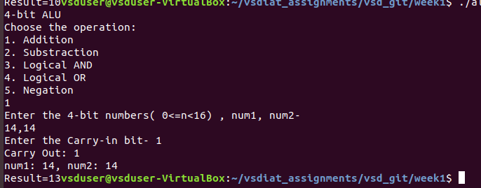
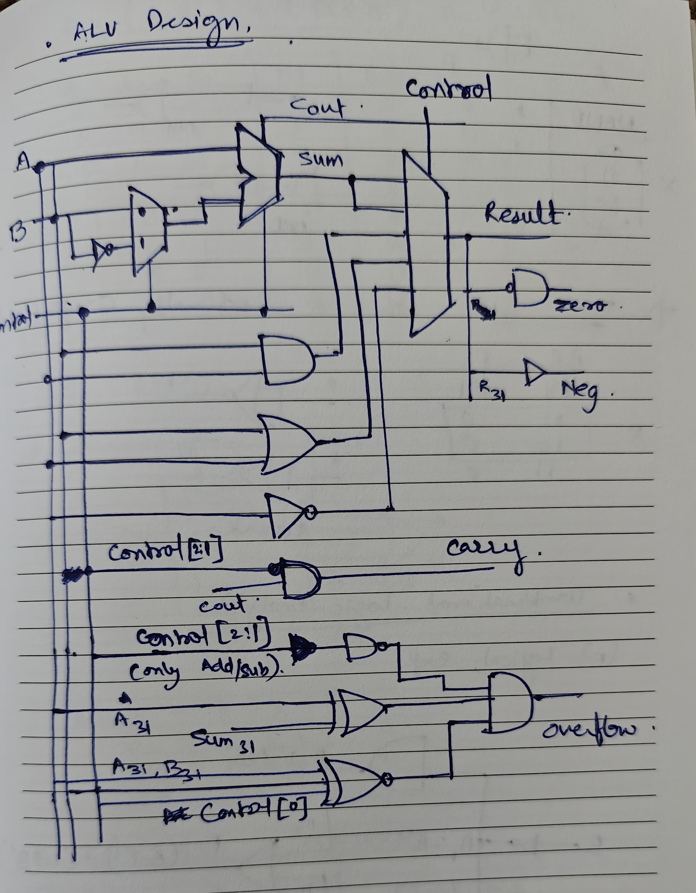
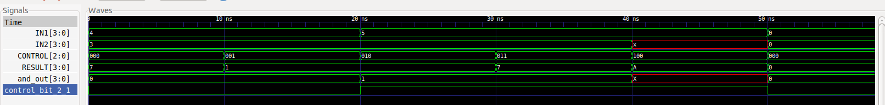

# WEEK1

**WEEK1 Assignments**

## CONTENTS
* [1's 2's complement](# 1's 2's complement) 
* [ALU code in C](# ALU code in C)
* [ALU code in Verilog](# ALU code in Verilog)

## 1's 2's complement

**10 - 19**  
|-----------------------------------------------------------------------------------------------| 
|			|	signed		|	1's Comp	|	2's Comp	| 
|-----------------------------------------------------------------------------------------------| 
|10 = 0b00001010 	|	0b00001010	|	0b00001010	|	0b00001010	| 
|-19= 0b00010011	|	0b10010011	|	0b11101100	|	0b11101101	| 
|-----------------------------------------------------------------------------------------------| 
|-9 = 0b00001001	|	0b10011101	|	0b11110110	|	0b11110111	| 
|-----------------------------------------------------------------------------------------------| 
 
**20 + 30** 
|-----------------------------------------------------------------------------------------------| 
|			|	signed		|	1's Comp	|	2's Comp	| 
|-----------------------------------------------------------------------------------------------| 
|20 = 0b00010100	|	0b00010100	|	0b00010100	|	0b00010100	| 
|30 = 0b00011110	|	0b00011110	|	0b00011110	|	0b00011110	| 
|-----------------------------------------------------------------------------------------------| 
|50 = 0b00110010	|	0b00110010	|	0b00110010	|	0b00110010	| 
|-----------------------------------------------------------------------------------------------| 
 
**36 - 12** 
|-----------------------------------------------------------------------------------------------| 
|			|	signed		|	1's Comp	|	2's Comp	| 
|-----------------------------------------------------------------------------------------------| 
|36 = 0b00100100	|	0b00100100	|	0b00100100	|	0b00100100	| 
|-12 = 0b00001100	|	0b10001100	|	0b11110011	|	0b11110100	| 
|-----------------------------------------------------------------------------------------------| 
|24 = 0b00011000	|	0b10110000	|	0b00010111	|	0b00011000	| 
|-----------------------------------------------------------------------------------------------| 
 

## ALU code in C

* File name: alu.c  
* 4-bit ALU with following operations- 
    Addition, substraction, Logical AND, Logical OR, Logical Negation  
    Addition support Cin and Cout, with additional but for Cout  
	

 
## ALU code in Verilog

* File name:  
    DUT: alu.v  
    TB : alu_test_2.v  

* 4-bit ALU design in Behavioural Verilog with addition, substraction, Logical AND, Logical OR and Negation  
    Output as 4-bit Result with NCZV bits.
    N-Negative output
    C-Carry out bit set
    Z-Zero output
    V-Overflow 
     

