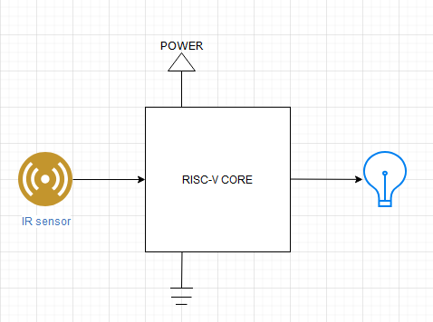
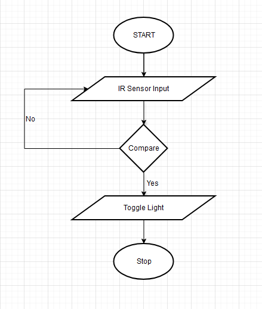

# SENSOR BASED LIGHTENING SOLUTION FOR CLOSED SPACES

## Table of Contents
* [Introduction](#Introduction)
* [Background](#Background)
* [Diagram](#Diagram)
* [Flowchart](#Flowchat)
* [Working](#Working)

## Introduction

    As part of the RISC-V skilling program, I have decided to do a application based design project with real life use case. The basic premise of the project is to develop a general prupose single sensor, single actuator platform that can be used for multiple purposes. The applications are varied and the user gets to customize the platform based on the needs. Some of the applications this can accomodate is automatic bathroom lightening, a plant watering system, fire sprinkler systems, bird or animal feeder. All these aplications use different sensors and actuators but have a common underlying functionality. For our project I'm going to implement an IR detection based dim lightening system for bathrooms.

## Background

    It often happens during the middle of the night we need to use the bathroom. For this we need to wake up in the dark and after entering the bathroom and switching on the lights our eyes have to immediately switch from a dark background to a brightly lit surrounding. This affects our body's sleep cycle as the brain now thinks the day has started and people find it difficult to go back to sleep after going to the bathroom. This product will help solve this issue as rather than switching on all the lights in the bathroom this solution will instead replace it with a dimly lit atmosphere so as not to disturb the sleep state of the mind and also allow us to operate in a safe environment providing only enough brightness necessary to finish the busincess.

## Diagram

## Flowchart

 

## Working

    This system will be activated when it detects movement in close proximity to the device, this is specifically so as to the light doesn't get activated for any random movement but is only switched on when necessary. This makes the system power efficient and purpose driven. The system will have a close proximity IR sensor which will detect a wave of hand, when it detects a movement, it will switch on the light, when the user again waves a hand, the system will toggle the light state. So, the light will basically switch between the two states and the IR input will act as a trigger. 

